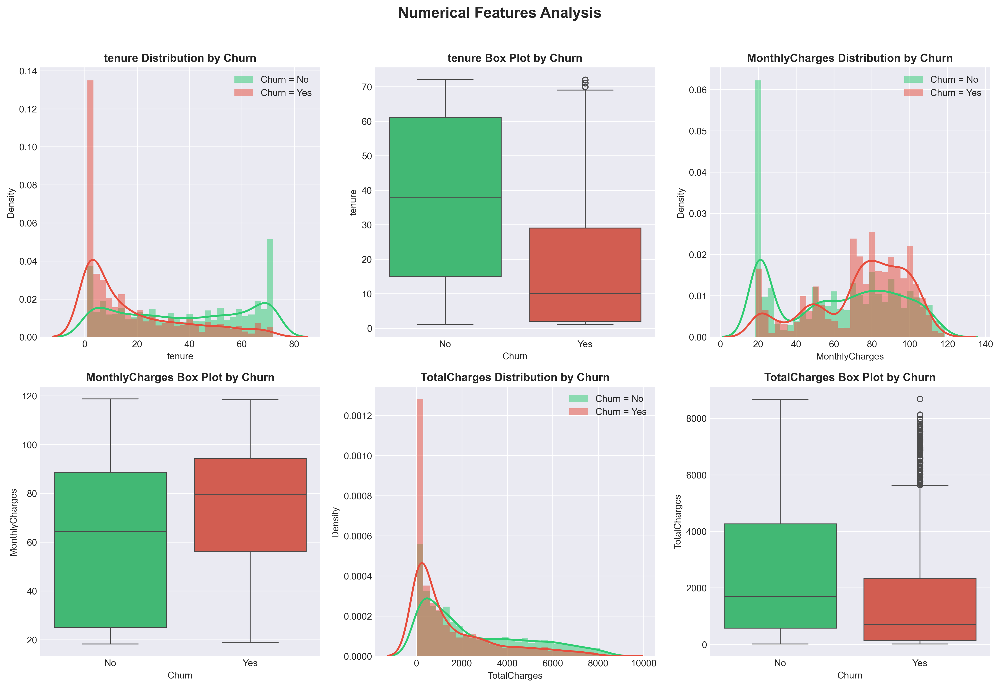
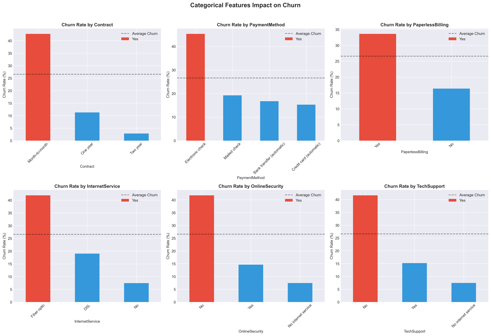
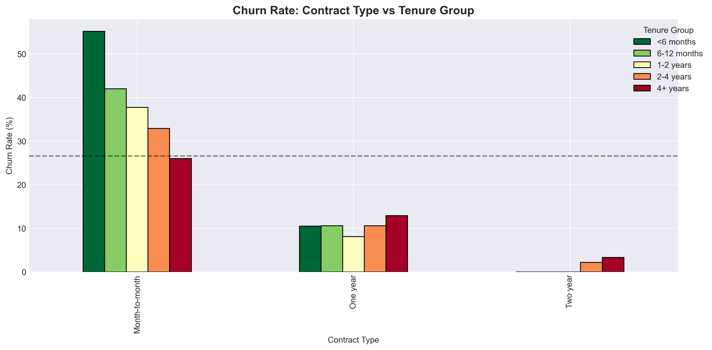
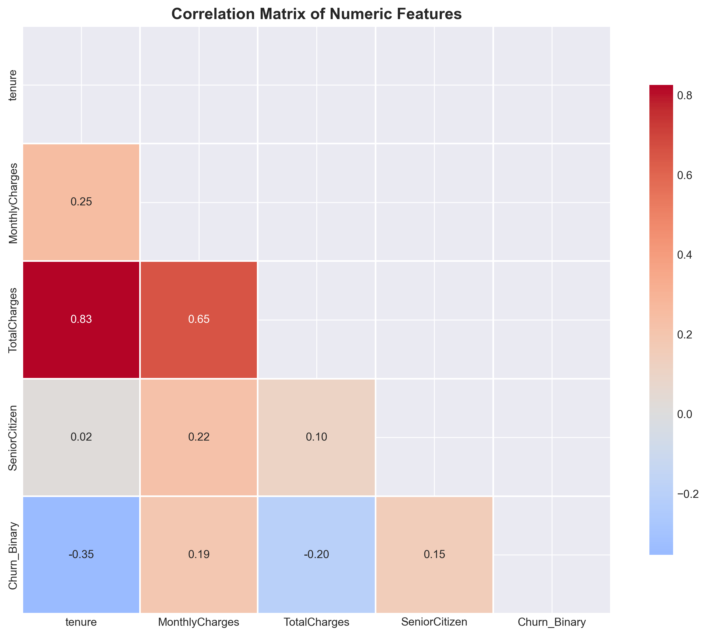
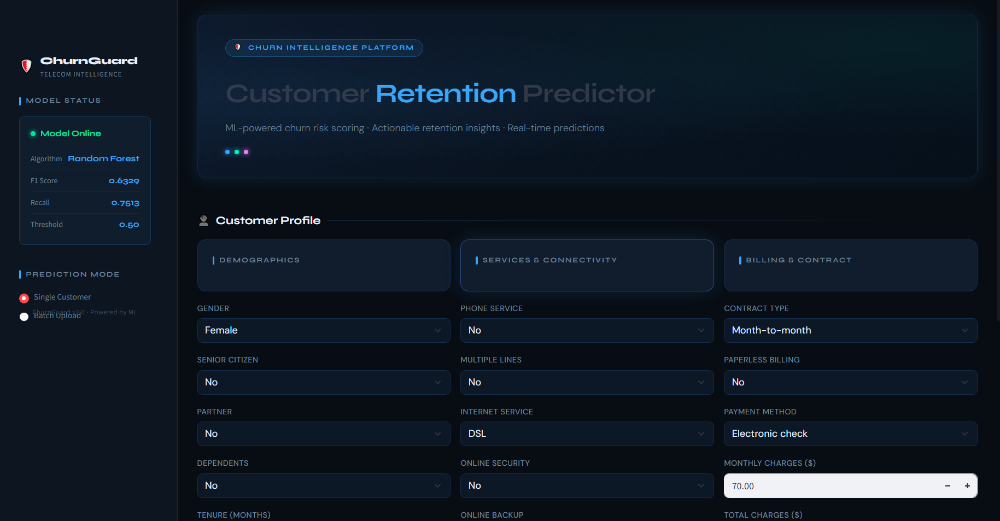
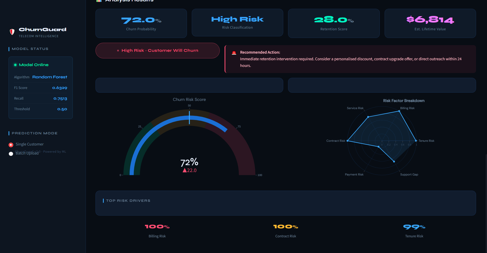
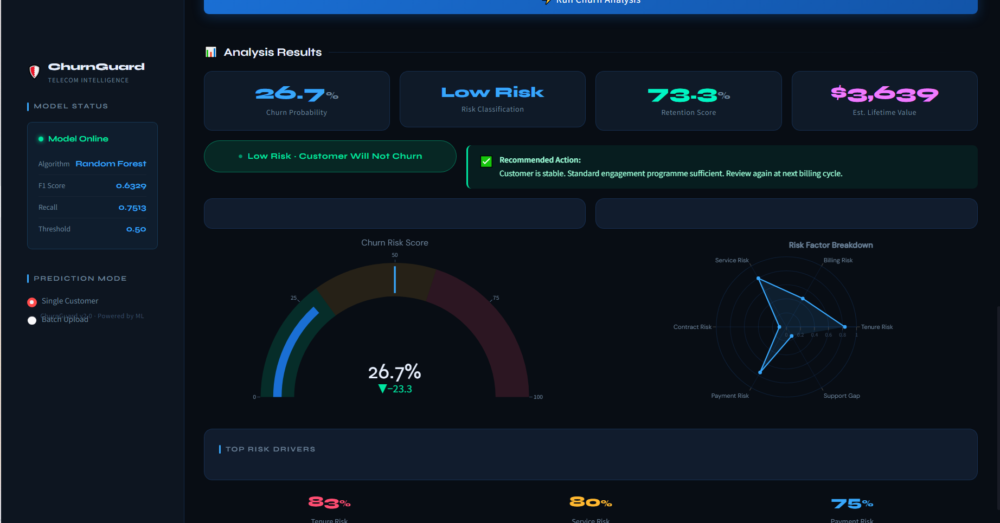
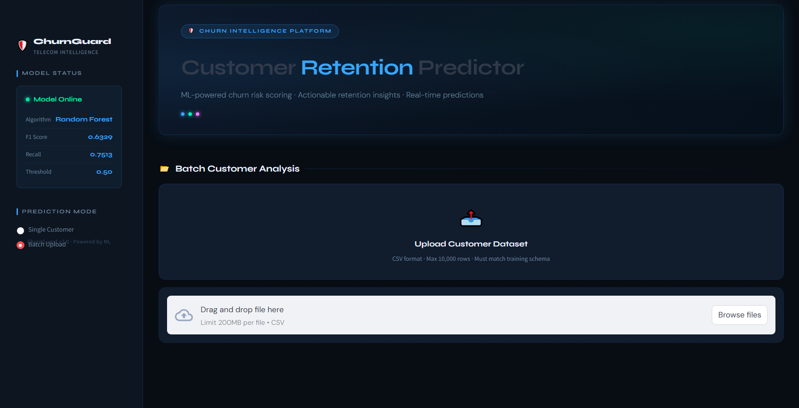

# Telco Customer Churn Prediction

## Overview
This project focuses on predicting customer churn in the telecommunications industry using Machine Learning. The goal is to identify customers who are likely to discontinue their services and provide actionable insights that can help improve customer retention strategies..

The project includes:
• Exploratory Data Analysis (EDA)  
• Feature Engineering  
• Machine Learning Modeling  
• Model Evaluation  
• Interactive Streamlit Deployment  
• Real-time Customer Churn Prediction  

________________________________________

## Business Problem
Customer churn is one of the biggest challenges in the telecom industry. Acquiring new customers is often more expensive than retaining existing ones.

This project aims to:
• Predict customers likely to churn  
• Understand major churn drivers  
• Support proactive retention campaigns  
• Improve customer lifetime value  

________________________________________

## Project Objectives
• Analyze customer behavior patterns  
• Identify key factors contributing to churn  
• Build a high-performing classification model  
• Deploy the model using Streamlit  
• Enable single and batch customer predictions  

________________________________________

## Dataset Information

Dataset Used:
• Telco Customer Churn Dataset  

Features include:
• Customer demographics  
• Account information  
• Contract details  
• Billing information  
• Internet services  
• Support services  

Target Variable:
• Churn  

________________________________________

## Tech Stack

Programming Language:
• Python  

Libraries & Frameworks:
• Pandas  
• NumPy  
• scikit-learn  
• XGBoost  
• Plotly  
• Matplotlib  
• Seaborn  
• Streamlit  
• Joblib  

________________________________________

## Machine Learning Workflow

### 1. Data Cleaning
• Handled missing values  
• Converted data types  
• Removed inconsistencies  

### 2. Exploratory Data Analysis (EDA)
• Customer churn distribution  
• Contract type analysis  
• Monthly charges analysis  
• Tenure analysis  
• Correlation analysis  
• Service usage patterns  

EDA Visualization Screenshots:

  
  
  
  

________________________________________

### 3. Feature Engineering
• Label encoding  
• One-hot encoding  
• Handling categorical variables  

________________________________________

### 4. Model Development
Several classification models were tested and compared:
• Random Forest  
• XGBoost  
• LightGBM  

Best-performing model selected based on:
• F1 Score  
• Recall  
• ROC-AUC  
• Precision  

________________________________________

## Model Performance

| Metric     | Score |
|------------|-------|
| F1 Score   | 0.63  |
| Recall     | 0.75  |
| Precision  | 0.55  |
| ROC-AUC    | 0.84  |

________________________________________

## Streamlit Application

The project includes an advanced interactive Streamlit dashboard for:
• Single customer prediction  
• Batch customer prediction  
• Risk analysis  
• Churn probability visualization  
• Retention insights  

Streamlit Dashboard Screenshots:

  
  
  
    

________________________________________

## Features of the Application

### Single Customer Prediction
• Predict churn probability for individual customers  
• Display retention score  
• Show risk classification  
• Recommend retention actions  

### Batch Prediction
• Upload CSV files  
• Predict churn for multiple customers  
• Download prediction results  
• Analyze cohort risk distribution  

________________________________________

## Project Structure

├── app.py  
├── best_churn_model.pkl  
├── scaler.pkl  
├── optimal_threshold.pkl  
├── model_metadata.pkl  
├── WA_Fn-UseC_-Telco-Customer-Churn.xlsx  
├── notebooks/  
├── images/  
├── requirements.txt  
└── README.md  

________________________________________

## Installation Guide

### Clone the Repository
git clone <your-repository-link>  
cd <repository-folder>  

### Create Virtual Environment
python -m venv env  

### Activate Environment

Windows:
env\Scripts\activate  

Mac/Linux:
source env/bin/activate  

________________________________________

## Install Dependencies
pip install -r requirements.txt  

________________________________________

## Run the Streamlit App
streamlit run app.py  

________________________________________

## Example Use Cases
• Telecom customer retention strategy  
• Customer behavior analysis  
• Churn risk monitoring  
• Business intelligence reporting  
• Predictive analytics solutions  

________________________________________

## Future Improvements
• Add SHAP Explainability  
• Deploy to cloud platforms  
• Real-time API integration  
• Automated retraining pipeline  
• Customer segmentation module  
• MLOps integration  

________________________________________

## Deployment Options
You can deploy this project using:
• Streamlit Community Cloud  
• Render  
• Railway  
• Hugging Face Spaces  

________________________________________

## Author

Your Name  
Data Scientist | Machine Learning Engineer  

GitHub:  
https://github.com/yourusername  

LinkedIn:  
https://linkedin.com/in/yourprofile  

________________________________________

## License
This project is licensed under the MIT License.  

________________________________________

## Acknowledgements
• IBM Sample Data Sets  
• scikit-learn Documentation  
• Streamlit Documentation  
